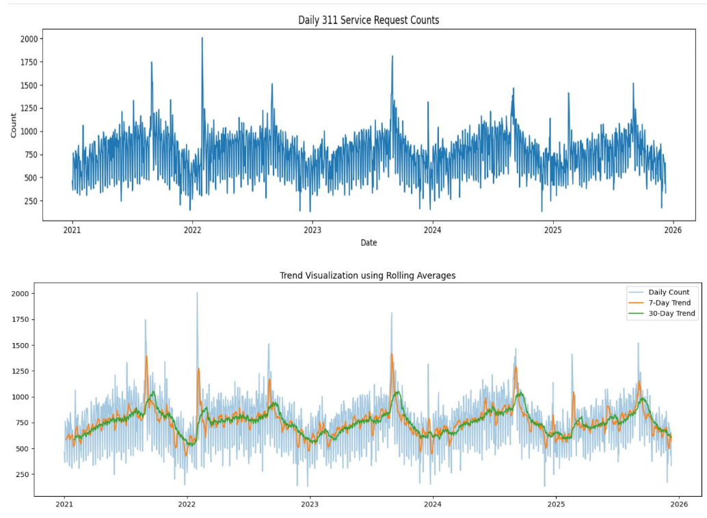
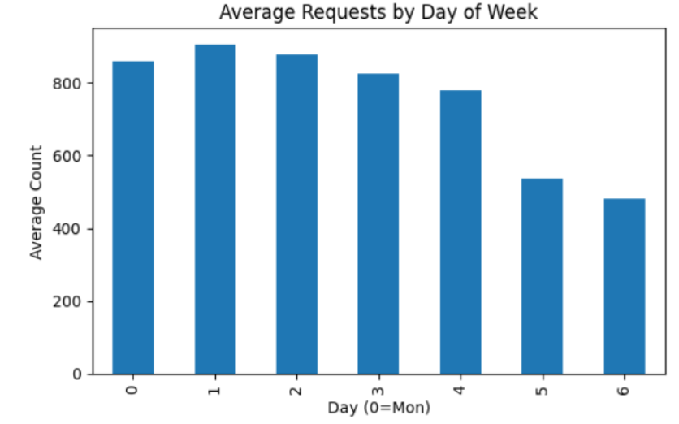
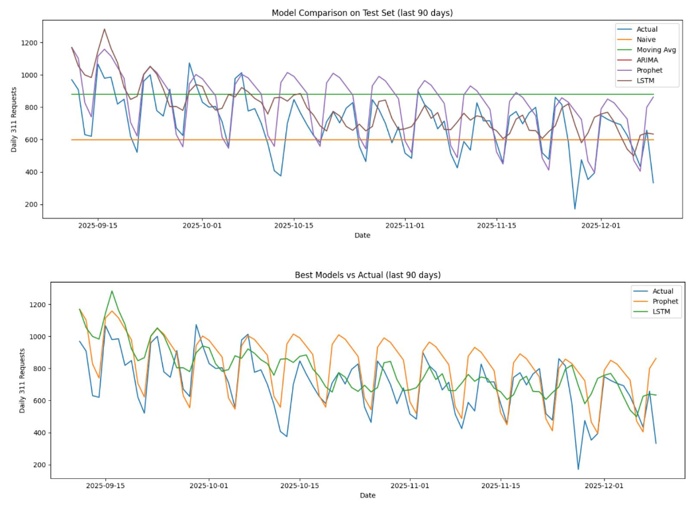

# Forecasting Urban Noise Pollution in Boston Using Time Series Analysis
> 📊 Time Series Forecasting | Urban Analytics | Real-World Data Project


---

## 📌 Project Overview

Urban noise pollution is a major quality-of-life issue in large cities. In this project, Boston 311 noise complaint data was studied to understand how complaints vary across time, weekdays, seasons, and neighborhoods. After cleaning and transforming the data, time series modeling was performed to forecast future complaint patterns.

---

## 🚀 Key Highlights

- End-to-end time series analysis using real-world Boston 311 data  
- Identified strong seasonal and weekly noise patterns  
- Built SARIMA model for forecasting urban noise complaints  
- Compared predictions with actual values for validation  
- Delivered actionable insights for urban planning  

---

The project combines:
- data preprocessing
- exploratory data analysis
- feature engineering
- time series forecasting
- model comparison and interpretation

---

## 🎯 Objectives

- Build a clean and structured dataset of Boston noise complaints
- Identify hourly, daily, weekly, and seasonal noise patterns
- Explore neighborhood-level complaint trends
- Model the complaint counts as a time series
- Forecast future noise complaint activity for planning and decision-making

---


## 📊 Dataset Note

The project uses Boston 311 noise complaint data collected over multiple years.

Due to file size limitations, the merged output dataset used in the modeling stage is **not stored in this GitHub repository**. The large merged dataset has been uploaded separately to Google Drive.

**Merged Output Dataset (Google Drive):**  
[View Dataset](https://drive.google.com/file/d/1takOJp3ha_M8LT5M6wK0DCIrxn1uBU5T/view?usp=sharing)

---

## 🛠️ Tools and Technologies

- Python
- Jupyter Notebook
- Pandas
- NumPy
- Matplotlib
- Seaborn
- Statsmodels
- Scikit-learn

---

## 📂 Repository Structure

```text
forecasting-urban-noise-pollution-boston/
│
├── notebook/
│   └── project.ipynb
│
├── report/
│   └── project_report.pdf
│
├── results/
│   ├── daily_noise_trend_with_rolling_average.png
│   ├── weekday_vs_weekend_noise_analysis.png
│   └── time_series_model_forecast_vs_actual.png
│
├── requirements.txt
└── README.md

```

---

## 🧹 Data Preprocessing

- Converted timestamps into proper datetime format  
- Removed missing or invalid records  
- Sorted dataset chronologically  
- Filtered noise-related complaints using keywords  
- Extracted time-based features:
  - Hour of day  
  - Day of week  
  - Month  
  - Season  
- Aggregated complaints into daily counts  
- Created a continuous time series dataset  

---

## 🔍 Exploratory Data Analysis

The analysis reveals strong patterns in urban noise behavior:

- Daily complaint trends show clear fluctuations across time  
- Warmer months have significantly higher complaint volumes  
- Late-night hours (9 PM – 2 AM) show peak activity  
- Weekends consistently have more complaints than weekdays  
- Certain neighborhoods (Allston, Fenway, Back Bay) show higher noise levels  

---

## 📉 Time Series Modeling

- Chronological train-test split (last 90 days as test set)  
- Model used: **SARIMA (Seasonal ARIMA)**  
- Configuration: **SARIMA(1,1,1)(1,1,1,7)**  
- Captures both trend and weekly seasonality  

---

## 📏 Model Evaluation

The model performance was evaluated using:

- MAE (Mean Absolute Error)  
- RMSE (Root Mean Squared Error)  
- MAPE (Mean Absolute Percentage Error)  

The model successfully captures:
- Weekly seasonal patterns  
- Long-term trends  
- Short-term fluctuations  
 

---

## ▶️ How to Run

1. Clone the repository
2. Install the required libraries from `requirements.txt`
3. Open the notebook in Jupyter Notebook or Google Colab
4. Update the dataset path if using the merged dataset from Google Drive
5. Run the notebook cells in sequence to reproduce the analysis and forecasting workflow

---

## 📌 Key Findings

- Noise complaints peak during summer months  
- Late-night hours show the highest activity  
- Weekends have more complaints than weekdays  
- High-density and nightlife-heavy areas show consistent spikes  
- Noise behavior is structured and predictable over time  

---

## 🔮 Forecast Insights

- Future complaint patterns follow strong seasonal trends  
- Weekly cycles remain consistent  
- Forecasting helps identify high-risk noise periods  
- Useful for urban planning and enforcement strategies  

---

## 💼 Business Impact

- Helps city authorities predict high-noise periods  
- Supports better resource allocation for complaint handling  
- Enables proactive noise control strategies  
- Improves urban livability through data-driven insights  

---

## Project Visuals
These visualizations highlight trend patterns, behavioral insights, and model performance.

### Daily Noise Trend with Rolling Average
Shows long-term complaint fluctuations, recurring seasonal behavior, and rolling trends over time.



### Weekday vs Weekend Noise Analysis
Highlights how complaint activity changes across the week and supports the finding that weekends tend to have higher noise-related activity.



### Time Series Model Forecast vs Actual
Compares actual complaint counts with forecasting approaches to evaluate how well the models capture temporal patterns.



---

## 🎓 Portfolio Value

This project demonstrates:

- Real-world data analysis using city datasets  
- Strong understanding of time series modeling  
- Ability to extract insights from complex data  
- Practical forecasting implementation  
- Clean project structuring and documentation

---

## 👤 Author

**Dev Patel**  
Master’s Student – Data Analytics Engineering  
Northeastern University  

GitHub: https://github.com/devp2611
